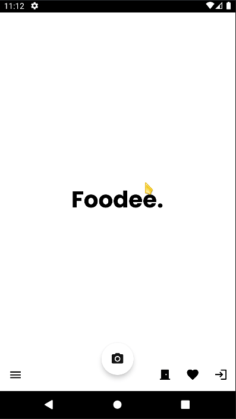

# Foodee - Android application

This repo consist of an android application named **Foodee** used to scan food articles.

  
Table of Contents

  <ol>
    <li>
      <a href="#about-the-project">About The Project</a>
      <ul>
        <li><a href="#built-with">Built With</a></li>
      </ul>
    </li>
    <li><a href="#contribution">Contribution</a></li>
  </ol>

## About the project

**Foodee** is a food article scanner app able to retrieve informations related to specific food products by scanning
their *UDP* or *EAN*. An authentication system is available to provide users additionnal features, such as favorites management.

Here is what it looks like:

### Built with

The project has been built with several tools and services, here is the list:

* [Kotlin 1.7.2](https://kotlinlang.org/) for the programming language
* [Android Studio Dolphin](https://developer.android.com/studio/releases) for the IDE
* [Jetpack](https://developer.android.com/jetpack) for backward compatibilities and best practices
* [Firebase](https://firebase.google.com/) for database hosting (using NoSQL Document)
* [BoM 31.0.3](https://firebase.google.com/docs/android/learn-more#bom) for library versioning
* [Auth](https://firebase.google.com/docs/auth) for google and facebook authentication
* [OpenFoodFacts](https://world.openfoodfacts.org/) for EAN and UPC scan api
* [Retrofit 2.9](https://square.github.io/retrofit/) for the REST client
* [Moshi 1.14](https://github.com/square/moshi) for Json parsing
* [Gradle 7.4](https://gradle.org/) for the project management and build automation
* [Barcode-scanning 17.0.2](https://developers.google.com/ml-kit/vision/barcode-scanning/android) for the barcode scanning api (from MLKit)

## Contribution

This little project has been made by:

* Maximilien Ballesteros (56080)

